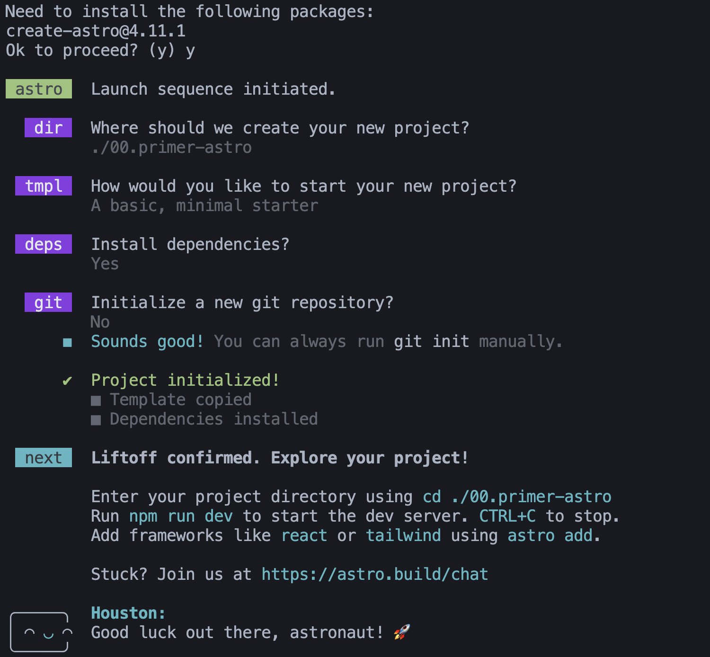
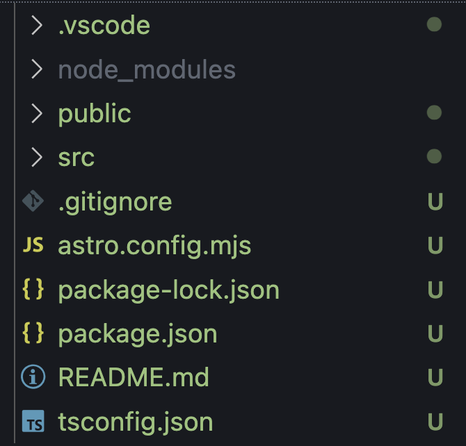
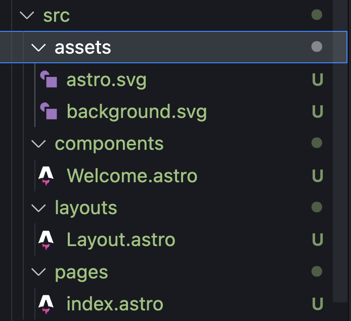

# learn-astro
Repositorio para aprender - wait for it - Astro

## Primeros pasos

### Requisitos previos

- Tener Node 20 o superior instalado => solo funciona con LTS
- Comprobad que funcionan los comandos `node -v` y `npm -v`
- Si queréis usar `pnpm` en vez de `npm` como gestor de paquetes:
```bash
  npm -g install pnpm # instala "pnpm" de forma global
```
- Puedes comprobar que lo tienes instalado con: `pnpm -v`

---

## Proyecto inicial 

Seguimos los pasos de [Tutorial de Instalación con el CLI](https://docs.astro.build/es/install-and-setup/). CLI := command line interface, es una herramienta de consola para iniciar, gestionar, etc. proyectos.

```bash
npm create astro@latest # latest usa la última versión stable
```


En la carpeta seleccionada durante el proceso tenemos varios archivos y carpetas:



```plaintext
├── README.md         -> indicaciones para aprender a usar Astro
├── astro.config.mjs  -> archivo de config para importar plugins
├── node_modules      -> carpeta de librerías, es donde se guardan las 
|                        descargas de npm install o pnpm install o yarn add
├── package-lock.json -> archivo con las versiones exactas de las
|                        dependencias descargadas => no se edita a mano
|                        👉🏼 Es posible que el -lock de otro SO no os funcione
|                        👉🏼👉🏼 Si os sucede, se borra este archivo y otra vez `npm i`
├── package.json      -> archivo base del proyecto donde hay metadatos, scripts, 
|                        y dependencias (que libs deben bajarse)
├── public            -> carpeta para colocar assets de uso público (logos, 
|                        imágenes, favicon, etc.)
├── src               -> los archivos y carpetas principales del proyecto
    ├── assets        -> imágenes, multimedia o documentos
    ├── components    -> .astro => componentes que necesitas en la web
    ├── layouts       -> plantillas para dar estructura
    └── pages         -> páginas a partir de layouts y componentes
└── tsconfig.json     -> archivo de configuración de TS
```

Más información de cómo empezar a usar Astro 5.5 en [Docs](https://docs.astro.build/es/basics/project-structure/).

### src



